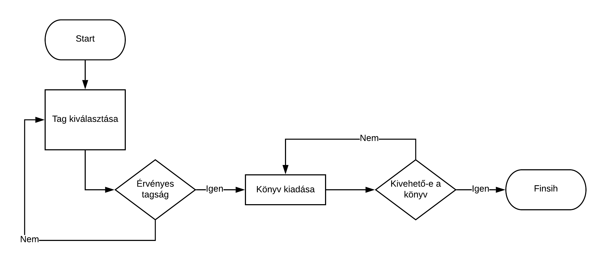
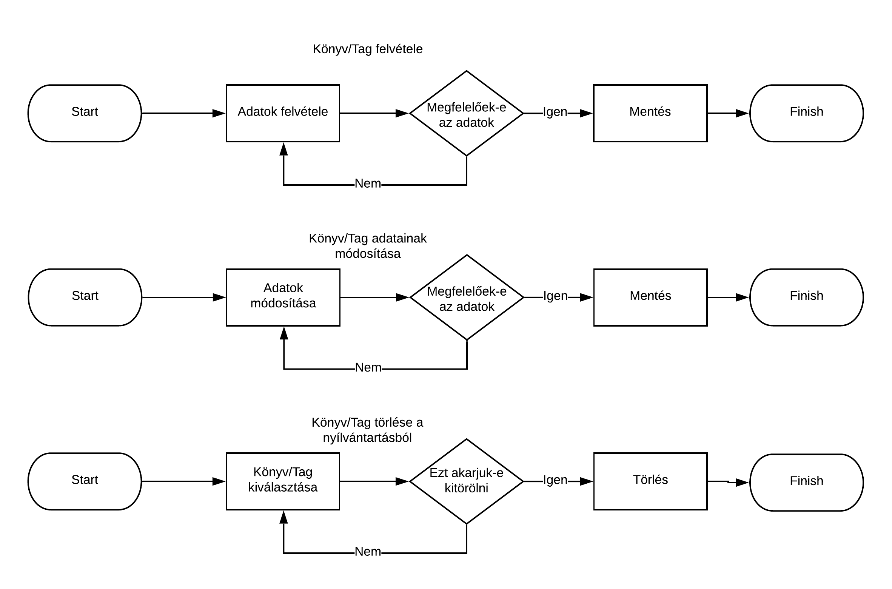
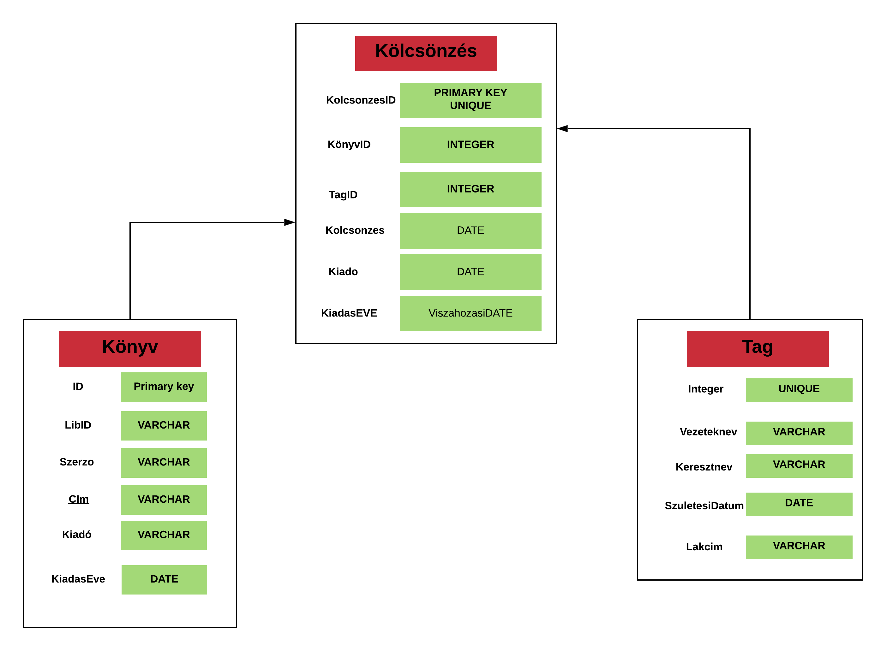

# TRYHARD  
## Rendszerterv  

### 1. Bevezetés 

A rendszerterv elkészítésének célja az ,hogy a program fejlesztőinek pontos, részletes 
és szaknyelvet tartalmazó leírás legyen a kezében ami kitér a  rendszerrel kapcsolatos összes fontos szakmai kérdésre.
A szoftver egy kisvárosi könyvkölcsönző működését hivatott elősegíteni.
Célja az analóg rendszer digitálisra cserélése ennek következtében a könyvtár
fenetarthatóságát képes növelni és a dolgozok munkáját meggyorsítani . 
Adminisztratív és  könyv kölcsönzés és egyéb feladatok ellátása számítógépes 
környezetben. A cél platformunk a kölcsönző tulajdonában lévő számítógépek mely 
Linux alapú operációs rendszer futtatnak, név szerint az Ubuntut. A megvalósítás 
miatt a program alkalmas lehet más operációs rendszer alatti futtatásra is, de 
ez nem elsődleges célja afejlesztésnek. A gépek hardverje 8 GB DDR4 -es RAMból, egy Intel
Core i7-8750H 2.20GHz típusú processzorból és egy NVIDIA GeForce GTX 1060
típusú videokártyából állnak. A gépek számára biztosítva van a stabil 10Mb/s
sávszélességű internet elérés. Ez által a megfelelő infrastruktúra kiégetésével 
megvan teremtve a megfelelő hátér ,hogy a dolgozok lehető legjobb hatásfokkal 
képesek legyenek használni a szoftvert.  A rendszer felé pitése egy szerver-kliens 
alapokra épülő modell,egy közös H2 adatbázis motorral rendelkező adatbázison, 
amelytárolja az elérhető könyveket, illetve az ügyfelek alapvetően szükséges 
adatait amely az "egyszerű és  egyben nagyszerű " elv alapján lesz elkészítve 
,hogy a könyvtárban dolgozók rövid tanulmányozás után képesek legyek átlátni a 
szoftver és kényelmesen tudják használni azt.Ezért a tervezet szerint olyan 
programozási nyelvet használunk ami megkönnyítői ennek a szoftvernek a leghatékonyabb
le kódolását. Erről bővében a Fejlesztő eszközök menüpontban térünk ki. 
A digitalizálás hatására sokall átláthatóbb kezelhetőbb és biztonságosabb lesz 
az új rendszer a régihez képest.
   
### 2. A rendszer célja 

A rendszer célja ,hogy a könyvtár elavult adminisztrációs módszereit felváltsa
ez a 21. századi, webes felületen futó és adatbázissal rendelkező alkalmazás
amivel a könyvtár adminisztrációs munkája gyorsabb, hatékonyabb és átláthatóbb
lesz. A programot használó könyvtári dolgozónak nagyon sok ideje fel fog szabadulni
a program gyorsasága miatt ,így foglalkozhat más teendőkkel is.

### 3. A projekt tervezete 

#### 3.1. A rendszer felépítése 

Az adatbázis kapcsolathoz szükséges egy adatbázis connection osztály,  
amely létrehozza, fenntartja, és zárja az adatbáziskapcsolatot.  
A felszedett adatokat webserver segítségével megfelelően repzezentálva szolgáltatjuk
a klienseknek, továbbá a felületen lehetőségük nyílik új adatok létrehozására,
módosítására, törlésére is. A megjelenítést html segítségével kívánjunk megvalósítani,
a designban nagy szerepet szánunk a Bootstap 4-nek is. A grafikus felület dinamikáját
a JavaScript biztosítja. A rendszer fő pontja így a központi gép, amelyiken a Tomcat fut, 
illetve ettől elkülönített, de akár egy gépen is futtatható SQL szerver is amely az adatokat
biztosítja. Javasoljuk a szerverek külön gépen futtatását, hogy egy esetleges hardverhiba
esetén csak az egyik része károsodjon a rendszernek.
A program controller részének megvalósítását Java programozási nyelven terveztük el.
A projekthez továbbá felhasználtuk a Maven nevű projekt menedzsment eszköztárat is.

#### 3.2. Projektmunkások és felelősségeik 
A projektet készítő négy személy teljesen egyenjogú szerepkörökkel rendelkezik.
Mind négyük kiveszi a részét a munka minden egyes fázisából és részéből. Mindnyájan
egyenrangú fejlesztői a programnak.

Név |   Szerepkör
-----------|---------
Keserű Kristóf  | szoftverfejlesztő
Szabó Ákos  | szoftverfejlesztő
Tóth Norbert    | szoftverfejlesztő
Varga Mátyás    | szoftverfejlesztő

### 4. Ütemterv   

#### 4.1. Mérföldkövek

A program elkészítésének fő mérföldkövei:  

##### 4.1.1. Sprint I.

- A Trelloban való regisztráció illetve a használatának elkezdése  
- A git repository elkészítése  
- A tagok git-re való regisztrációja illetve a projekthez felvétele  
- A követelményspecifikáció elkészítése  
- A funckionális specifikáció elkészítése  
- A rendszerterv elkészítése
- A program prototípus UI-jának elkészítése

##### 4.1.2.Sprint II.
  
- A rendszer tesztjeinek felállítása  
- A program adatbázisának elkészítése  
- A program controllerének elkészítése  
- A program tesztelése a minimális funkciókkal

##### 4.1.3. További sprintek

- A program biztonságának növelése, felkészítés az internetes használatra
- A felhasználó visszajelzések beletervezése a projektbe
- A kisebb üzleti értékkel rendelkező kényelmi feature-ök fejlesztése
   

### 5. Üzleti szereplők  

A programot az éppen munkaidőben jelenlévő könyvtáros fogja használni.  
A könyvtár összes alkalmazottjának, akik ebben a munkakörben dolgoznak  
megvan a végzettsége és a tudása ahoz ,hogy TRYHARD csapat által készített  
programot magabiztosan képes legyen használni.  

#### 5.1. Üzleti entitások  

Az üzletben résztvevő entitások:  
- A programot használó könyvtári alkalmazott  
- A könyvtárban regisztrált tagok  
- A könyvtárban még nem regisztrált, de majd regisztráló tagok

### 6. Követelmények

#### 6.1.Funkcionális követelmények 

- Könnyen és egyszerűen kezelhető rendszer.
- Jól átlátható adatbázis kezelés.
- Egyszerű adatbázis lekérdezések lebonyolítása.
- Könnyed adatfelvétel és módosítás.

#### 6.2. Nem funkcionális követelmények

- Esztétikus felhasználói felület.
- Látás károsultak számára is megfelelő színvilág és betűméretek használata.
- Clean code-nak való megfelelés.

### 7. Funkcionális terv   
A progrem célja a könyvtári munka felgyorsítása. A könyvtárban dolgozó személyzet
munkájának megkönnyebbítése. A jelenlegi analóg adminisztrációs módszer teljes felcserélése
digitális formára. A korábbi módszer minden 'funkciójának' átültetése számítógépes környezetbe.
Ezek a 'funkciók' nem mások, mint:
 - Könyvtár könyvjeinek nyílvántartása.
 - A könyvtár tagjainak nyílvántartása.
 - A kölcsönzési tranzakciók feljegyzése.
 - Bizonyos esetekben tagság megvonása.
 - Amortizáció esetén könyvek kivonása a nyílvántartésból.

### 8. Rendszerszereplők  

A rendszerben két féle entitás csoportot külömböztetünk meg.

A két csoport:
- Könyvtárosok csoportja
- Tagok csoportja

A programot a könyvtárosok csoportja fogja használni és egyfajta szolgáltatást
nyújt ezzel a tagok csoportjának.

A Könyvtárosok csoportjának sokkal több joga lesz, sőt a tagok nem is használhatják
a programot. Nekik kell lebonyolítani a kapcsolattartást is a tagokkal.
Feladatuk kiterjed a tagok értesítésére elmaradás esetén.

### 9. Rendszerhasználati esetek és lefutásai

####  9.1. Hardver és hálózati topológia

A felhasználói gépeknek el kell érniük a szerverként üzemelő központi gépet,
amely kiszolgálja a kéréseket, így a szoftver telepítése csak itt szükséges.
A rendszer internethez való csatolását nem javasoljuk.

A gépek hardvere:
- 8 GB DDR4-es RAM
- Intel Core i7-8750H 2.20GHz típusú processzor
- NVIDIA GeForce GTX 1060 videokártya

A cél platformunk a kölcsönző tulajdonában lévő számítógépek melyeken Linux alapú
operációs rendszer futtatnak (Ubuntu 18.04-et).
A megvalósítás miatt a program alkalmas más operációs rendszer alatti futtatásra is.

### 10. Fejlesztő eszközök  

A projekt során használt fejlszetői eszközök:  
- Java 11
- Maven 3 
- SQL  
- JavaScript

### 11. Keretrendszer   

- JQuery
- Bootstrap 4
- Spring Boot

### 12. Architekturális terv   

 rendszert felépítő alrendszerek
(szoftver komponensek) lényegében a Java ,Sql ,Mavan használata Java FX keretén belüli
használata.Az alrendszerek meghatározása után a tulajdonságaikat kiaknázva vezérlési,
valamint kommunikációs kapcsolatokat lehet létrehozni ez által. Ennek a megfelelő
komponensek és összekötök ismeretében magas szintű tervezetet jön létre. A rendszer
szerepe az érdekelt szereplő kommunikációjának lehetővé tétele ,a korai fejlesztési
fázisok döntéseinek támogatása a követelmények tükrében és emelet igen fontos a Nagy lépték"
újrafelhasználhatóság elősegítése. Ehez persze szükség van különféle forrásokra mint Üzleti és technológiai döntések
eredménye ,meghatározó a környezet szerepe , fejlesztők céljai és stratégiája által
befolyásolt követelmények vezetnek különféle szoftver architektúrákhoz. 
Mint minden folyamat ez is egy ciklus körül forog mint az :
- architektúrát meghatározó fejlesztő szervezet szerkezetéből
- szereplők
- Követelmények
- Technológiai környezet
- A tervező tapasztalata
 
Architektúra elemek:
- Architektúrális minta
  - típus elemek és kapcsolatok, kényszerek
  - pl. kliens-szerver minta
-  Referencia modell
   - standard funkcionális felosztás és
    adatfolyam megoldások
   - pl. adatbázis kezelő rendszer
- Referencia architektúra
  -   referencia modell leképezése szoftver
      elemekre
   - pl. ISO OSI architektúra  

#### 12.1. Rendszer bővíthetősége  

A rendszert teljesen objektum orientált szemlélet szerint fogjuk megírni
vagyis a rendszer bizonyos szinten bővítésre alkalmas lesz.

#### 12.2. Biztonsági funkciók 

A programunkba nem tervezünk biztonsági funkciókat implementálni.

#### 12.3. Adatbázis terv  

A program adatbázisát 3 fő táblára osztottuk:

Könyv:
- Könyvtári ID
- Szerző
- Cím
- Kiadó
- Kiadás éve
- Elérhető

Kölcsönzés:
- Kölcsönzés ID
- Tag ID
- Kölcsönzés dátum
- Határidő
- Visszahozási dátum

Tag:
- Azonosító
- Keresztnév
- Vezetéknév
- Születési dátum

#### 12.4. Logikai adatmodell  

Könyv           | Kölcsönzés                            |Tag  
   ----------------|---------------------------------------|---------  
   ID Primary key  |KolcsonzesID PRIMARY KEY, UNIQUE       |unique INTEGER           
   LibID VARCHAR   |KonyvID FOREIGN KEY(KONYV.ID) INTEGER  |Vezeteknev VARCHAR                         
   Szerzo VARCHAR  |TagID FOREIGN KEY(TAG.ID) INTEGER      |Keresztnev VARCHAR                     
   Cim  VARCHAR    | KolcsonzesDatum  DATE                 |Születési datum  DATE                     
   Kiado VARCHAR   |Hatarido DATE                          |   Lakcim VARCHAR                    
   KiadasEve DATE  |VisszahozasDatum DATE                  |            

### 13. Implementációs terv

A tervezési folyamatban célszerű az általános logikai felépítést mindig valamilyen 
grafikus reprezentációval
modellezni, mert az emberi agy vizualizált objektumokkal könnyebben dolgozik.
Az UML (=Unified Modeling Language), modellező nyelv segítségével a specifikációt és 
a tervezést is grafikus
formában, diagramok segítségével tudjuk dokumentálni. A követelményspecifikációban a használati
esetdiagramokat (use case), az adatbázis tervezésnél az adatbázis diagramot, az OOP 
tervezésnél az
osztálydiagramot és objektumdiagramot valamint a szekvenciadiagramot, aktivitásdiagramot
használhatjuk.
#### 13.1. Perzisztencia-osztályok 

A perzisztencia megvalósításáért a Hibernate objektum-relációs leképezést
megvalósító programkönyvtár felel.
Perzisztencia osztályok:
   -DBUtils
   -HibernateUtils
   
#### 13.2. Üzleti logika osztályai  
Az üzleti logika a háromrétegű adatkezelő alkalmazások középső rétege, amely meghatározza 
az alkalmazás működésének logikáját.
A háromrétegű architektúra az alkalmazást három különálló rétegre osztja fel. E rétegek 
komponensei önállóan léteznek, és együttműködésük során egyidejűleg több különböző 
alkalmazásnak is a részei lehetnek.
Az adatbázislogika az adatok nyers tárolását végzi. Semmilyen információval nem rendelkezik 
az adatok feldolgozásával vagy megjelenítésével kapcsolatban.
Az ügyviteli (üzleti) logika az alkalmazás logikáját, működési szabályait határozza meg. 
Semmilyen információval nem rendelkezik az adatok tárolásával vagy megjelenítésével kapcsolatban.
A felhasználói interfész feladata az ügyviteli logika által küldött adatok formázása és
megjelenítése. Biztosítja a felhasználó hozzáférését az ügyviteli logika szolgáltatásaihoz. 
Sohasem kerül közvetlen kapcsolatba az adatbázissal, és nem végez semmilyen műveletet az 
adatokon.

### 14. Tesztterv  

Kód|Leírás|  
----|---  
T01:| A program elindítása  
T02: |Az adatbázisból egy létező könyvre való rákeresés  
T03: |Az adatbázisból egy nem létező könyvre való rákeresés  
T04: |Egy könyv hozzáadása az adatbázishoz  
T05: |Egy könyv állapotának kikölcsönzöttről való átállítása elérhetőre  
T06: |Egy könyv állapotának elérhetőről való átállítása kikölcsönzöttre  
T07: |Egy tag felvétele a tagok adatbázisába  
T08: |Egy tag eltávolítása a tagok adatbázisából
T09: |Egy könyv kikölcsönzése
T10: |Több könyv kikölcsönzése